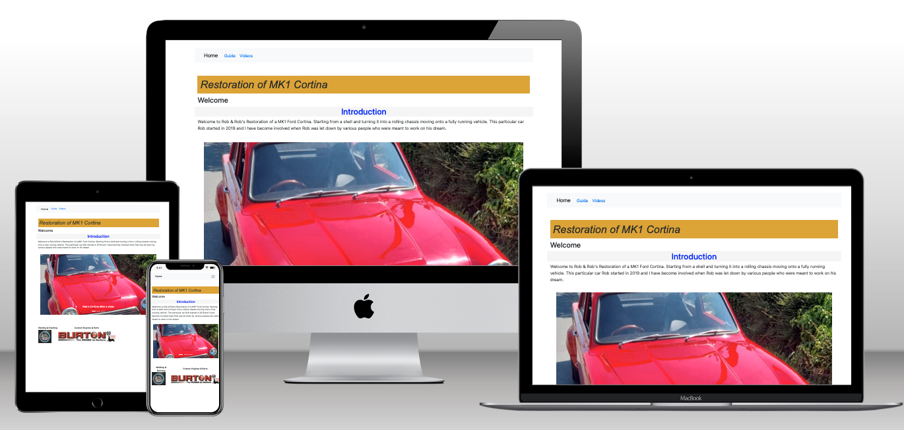

# Restore A MK1 Cortina
## Introduction
Restore A Cortina is a static front-end website used to document the journey of the restoration of a MK1 Ford Cortina.
It is a blog style site that guides the viewer through the remarkable transformation of a rusted broken shell to the running drag racing beast that she is today.  
I decided to create this as a resource for restoration enthusiasts as well as a way of reminding the owner of how far his car has come since Lockdown 1.

I have designed it to be a responsive website which is simple to navigate and easy to read.
---

---

## Website Features
The site is built using HTML5 for content and structure of the website, CSS for styling and layout and I have used Bootstrap for the nav bar and carousel and to maintain responsive screen sizing throughout.  The site currently consists of 3 pages:
Home Page:
The landing page for the website, containing an introduction, a few images of the subject and some helpful links to sites and companies used in the restoration.
Guide Page:
This page contains some of the images from the restoration, an unordered list that is ordered in the stages of the restoration.  Each list item will be linked to a separate page with the process and images of the title of the list.
Videos Page:
This page contains more photos and videos of each part of the restoration.  Each photo is titled and descriptive to help find the specific part of the restoration.

---

## Files & Folders
index.html - The home page of the site
guide.html - The step by step unordered list with accompanied images
videos.html - Iages and videos of the restoration process.  I could have called this page gallery, but I felt videos made it more obvious as to what the page contains.
images/ - Folder containing all media related files used on the site:
  - gallery/ - Folder of images in the carousel
    - 
